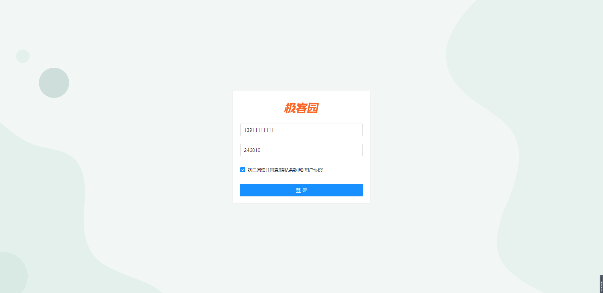

# 极客园PC端项目【登录模块】

登录模块的功能，包括：

1. 登录页面布局
2. 登录表单校验
3. 登录Redux逻辑
4. 工具函数封装：request/token/history

## 登录-基本结构



**目标**：能够利用模板代码搭建基础布局
**步骤**：

1. 在 Login/index.js 中创建登录页面基本结构
2. 在 Login 目录中创建 index.scss 文件，指定组件样式
3. 将 logo.png 和 login.png 拷贝到 assets 目录中

**核心代码**：

pages/Login/index.js 中：

```js
import { Card } from 'antd'
import logo from '../../assets/logo.png'
import './index.scss'

const Login = () => {
  return (
    <div className="login">
      <Card className="login-container">
        
        {/* 登录表单 */}
      </Card>
    </div>
  )
}

export default Login
```

pages/Login/index.scss 中：

```scss
.login {
  width: 100%;
  height: 100%;
  position: absolute;
  left: 0;
  top: 0;
  background: center/cover url(../../assets/login.png);

  .login-logo {
    width: 200px;
    height: 60px;
    display: block;
    margin: 0 auto 20px;
  }

  .login-container {
    width: 440px;
    height: 360px;
    position: absolute;
    left: 50%;
    top: 50%;
    transform: translate(-50%, -50%);
    box-shadow: 0 0 50px rgb(0 0 0 / 10%);
  }

  .login-checkbox-label {
    color: #1890ff;
  }
}
```

**总结**：

1. Card 卡片组件，可以用来实现登录框内容的包裹

## 登录-创建表单

**目标**：能够使用 antd 的 `Form` 组件创建登录表单
**步骤**：

1. 打开 antd [Form 组件文档](https://ant.design/components/form-cn/)
2. 找到代码演示的第一个示例（基本使用），点击`< >`（显示代码），并拷贝代码到组件中
3. 分析 Form 组件基本结构
4. 调整 Form 组件结构和样式

**核心代码**：

pages/Login/index.js 中：

```js
import { Card, Form, Input, Button, Checkbox } from 'antd'


<Card className="login-container">
  {/* 图片 */}
  
  {/* 表单 */}
  <Form autoComplete="off" size="large">
    <Form.Item>
      <Input placeholder="请输入手机号" />
    </Form.Item>

    <Form.Item>
      <Input placeholder="请输入验证码" />
    </Form.Item>

    <Form.Item>
      <Checkbox>我已阅读并同意[隐私条款]和[用户协议]</Checkbox>
    </Form.Item>

    <Form.Item>
      <Button type="primary" htmlType="submit" block>
        登录
      </Button>
    </Form.Item>
  </Form>
</Card>
```

**总结**：

1. 通过哪个属性调整 Input/Button 的大小？
2. Button 组件通过哪个属性设置为 submit 按钮？

## 登录-表单校验

**目标**：能够为手机号和密码添加表单校验
**步骤**：

1. 为 Form 组件添加 `validateTrigger` 属性，指定校验触发时机的集合
2. 为 Form.Item 组件添加 name 属性，这样表单校验才会生效
3. 为 Form.Item 组件添加 `rules` 属性，用来添加表单校验

**核心代码**：

pages/Login/index.js 中：

```js
const Login = () => {
  return (
    <Form validateTrigger={['onBlur', 'onChange']}>
      <Form.Item
        name="mobile"
        rules={[
          {
            pattern: /^1[3-9]\d{9}$/,
            message: '手机号码格式不对',
            validateTrigger: 'onBlur'
          },
          { required: true, message: '请输入手机号' }
        ]}
      >
        <Input size="large" placeholder="请输入手机号" />
      </Form.Item>
      <Form.Item
        name="code"
        rules={[
          { len: 6, message: '验证码6个字符', validateTrigger: 'onBlur' },
          { required: true, message: '请输入验证码' }
        ]}
      >
        <Input size="large" placeholder="请输入验证码" maxLength={6} />
      </Form.Item>
      <Form.Item name="remember" valuePropName="checked">
        <Checkbox className="login-checkbox-label">
          我已阅读并同意「用户协议」和「隐私条款」
        </Checkbox>
      </Form.Item>

      <Form.Item>
        <Button type="primary" htmlType="submit" size="large" block>
          登录
        </Button>
      </Form.Item>
    </Form>
  )
}
```

**总结**：

1. 表单校验时 Form.Item 可以没有 name 属性吗？

- 注意：
  1. Form.Item rules 中的 `validateTrigger` 必须是 Form.Item 或 Form `validateTrigger` 的子级

---

## 自定义校验

+ 阅读条款和协议需要使用自定义校验

```jsx
<Form.Item
  name="agree"
  valuePropName="checked"
  rules={[
    {
      validator: (rule, value) => {
        if (value === true) {
          return Promise.resolve()
        } else {
          return Promise.reject(new Error('请阅读并同意条款和协议'))
        }
      }
    }
  ]}
>
  <Checkbox>我已阅读并同意[隐私条款]和[用户协议]</Checkbox>
</Form.Item>
```


## 登录-获取登录表单值

**目标**：能够拿到登录表单中的手机号码和验证码
**步骤**：

1. 为 Form 组件添加 `onFinish` 属性，该事件会在点击登录按钮时触发
2. 创建 onFinish 函数，通过函数参数 values 拿到表单值
3. 为了方便，为 Form 组件添加 `initialValues` 属性，来初始化表单值

**核心代码**：

pages/Login/index.js 中：

```js
const onFinish = values => {
  console.log(values)
}

<Form
  onFinish={onFinish}
  initialValues={{
    mobile: '13911111111',
    code: '246810',
    agree: true
  }}
>...</Form>
```

**总结**：

1. 如何获取到 Form 表单中的值？
2. 通过哪个属性可以为 Form 表单初始化值？

## 登录-配置Redux

**目标**：能够完成Redux的基础配置
**步骤**：

1. 安装 redux 相关的包：`yarn add redux react-redux redux-thunk redux-devtools-extension axios`
2. 在 store 目录中分别创建：actions 和 reducers 文件夹、index.js 文件
3. 在 store/index.js 中，创建 store 并导出
4. 创建 reducers/index.js 文件，创建 rootReducer 并导出
5. 创建 reducers/login.js 文件，创建基础 login reducer 并导出
6. 在 src/index.js 中为 React 组件接入 Redux

**核心代码**：

store 目录结构：

```html
/store
  /actions
  /reducers
    index.js
  index.js
```

store/index.js 中：

```js
import { createStore, applyMiddleware } from 'redux'
import thunk from 'redux-thunk'
import { composeWithDevTools } from 'redux-devtools-extension'
import rootReducer from './reducers'

const middlewares = composeWithDevTools(applyMiddleware(thunk))
const store = createStore(rootReducer, middlewares)

export default store
```

store/reducers/index.js 中：

```js
import { combineReducers } from 'redux'

import login from './login'

const rootReducer = combineReducers({
  login
})

export default rootReducer
```

store/reducers/login.js 中：

```js
const initValue = {
  token: ''
}
export default function login(state = initValue, action) {
  return state
}

```

src/index.js 中：

```js
import { Provider } from 'react-redux'
import store from './store'

ReactDOM.render(
  <Provider store={store}>
    <App />
  </Provider>,
  document.getElementById('root')
)
```

**总结**：

## 封装axios 的工具函数

+ 安装axios

```jsx
yarn add axios
```

+ 新建文件`utils/request.js`

```jsx
// 封装axios
import axios from 'axios'

const instance = axios.create({
  baseURL: 'http://geek.itheima.net/v1_0/',
  timeout: 5000
})

// 添加请求拦截器
instance.interceptors.request.use(
  function (config) {
    // 在发送请求之前做些什么
    return config
  },
  function (error) {
    // 对请求错误做些什么
    return Promise.reject(error)
  }
)

// 添加响应拦截器
instance.interceptors.response.use(
  function (response) {
    // 对响应数据做点什么
    return response
  },
  function (error) {
    // 对响应错误做点什么
    return Promise.reject(error)
  }
)

export default instance

```

+ 测试

## 登录-Redux登录

**目标**：能够通过 Redux 实现登录功能
**步骤**：

1. 在 Login 组件中 dispatch 登录的异步 action
2. 创建 actions/login.js 文件，实现登录逻辑
3. 创建 actions/index.js 文件，统一导出 login 中的函数，简化导入
4. 在 reducers/login.js 中，处理登录相关状态
5. 在 store/index.js 中，从本地缓存初始化 Redux 的 token 状态

**核心代码**：

pages/Login/index.js 中：

```js
// 当表单校验通过，就会执行onFinished,并且会携带数据
const dispatch = useDispatch()
const onFinish = (values) => {
  console.log('Success:', values)
  // 发送请求，进行登录
  dispatch(login(values))
}
```

store/actions/login.js 中：

```js
import request from '@/utils/request'
import { LOGIN } from '../constants'
export const login = (payload) => {
  return async (dispatch) => {
    const res = await request({
      method: 'post',
      url: '/authorizations',
      data: payload
    })
    dispatch({
      type: LOGIN,
      payload: res.data.data.token
    })
  }
}
```

store/constants/index.js

```jsx
export const LOGIN = 'LOGIN'

```

store/reducers/login.js 中：

```js
import { LOGIN } from '../constants'

const initValue = {
  token: ''
}
export default function login(state = initValue, action) {
  if (action.type === LOGIN) {
    return {
      ...state,
      token: action.payload
    }
  }
  return state
}

```

**总结**：

1. 使用 Redux 的套路： *组件 dispatch 异步 action -> actions 提供异步 action -> 异步 action 完成异步操作 -> 继续 dispatch 普通 action 来发起状态更新 -> reducers 处理状态更新*

## 登录-把token存储到本地

**目标**：能够统一处理 token 的持久化相关操作
**步骤**：

1. 创建 utils/token.js 文件
2. 分别提供 getToken/setToken/clearToken/isAuth 四个工具函数并导出
3. 创建 utils/index.js 文件，统一导出 token.js 中的所有内容，来简化工具函数的导入
4. 将登录操作中用到 token 的地方，替换为该工具函数

**核心代码**：

utiles/storage.js 中：

```js
// 封装本地存储的操作
const TOKEN_KEY = 'itcast_geek_pc'

export function getToken() {
  return localStorage.getItem(TOKEN_KEY)
}

export function setToken(token) {
  localStorage.setItem(TOKEN_KEY, token)
}

export function removeToken() {
  localStorage.removeItem(TOKEN_KEY)
}

export function hasToken() {
  return !!getToken()
}

```

store/actions/login.js 中：

```js
export const login = (payload) => {
  return async (dispatch) => {
    const res = await request({
      method: 'post',
      url: '/authorizations',
      data: payload
    })
    const token = res.data.data.token
    // 存储到本地
    setToken(token)
    // redux中存储
    dispatch({
      type: LOGIN,
      payload: token
    })
  }
}
```

store/index.js 中：

```js
// 三个参数
// 参数1：reducer
// 参数2：可选的对象，可以用于提供初始值
// 参数3：提供中间件
const store = createStore(
  reducer,
  {
    login: {
      token: getToken()
    }
  },
  composeWithDevTools(applyMiddleware(thunk))
)

export default store
```

## 消息提示组件的使用

+ 登录成功后，提示消息，并且跳转到首页

```jsx
const history = useHistory()
const onFinish = async (values) => {
  // console.log('Success:', values)
  // 发送请求，进行登录
  try {
    await dispatch(login(values))
    message.success('登录成功', 1, () => {
      history.push('/home')
    })
  } catch (e) {
    message.error(e.response.data.message, 1)
  }
}
```

## 给按钮增加loadding状态

+ 提供一个状态loading

```jsx
const [loading, setLoading] = useState(false)
```

+ 发送请求，修改loading状态

```jsx
const onFinish = async (values) => {
  setLoading(true)
  // console.log('Success:', values)
  // 发送请求，进行登录
  try {
    await dispatch(login(values))
    message.success('登录成功', 1, () => {
      history.push('/home')
    })
  } catch (e) {
    message.error(e.response.data.message, 1, () => {
      setLoading(false)
    })
  }
}
```

+ 使用loading状态

```jsx
<Button type="primary" htmlType="submit" block loading={loading}>
  登录
</Button>
```

