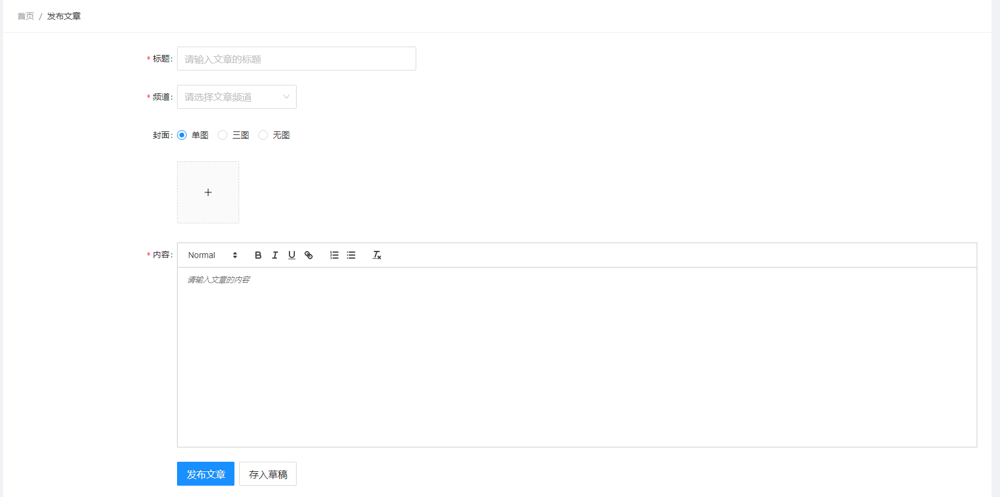

# 极客园PC项目【发布文章】



## 发布文章-基本结构

**目标**：能够搭建发布文章页面的基本结构
**步骤**：

1. 使用 Card、Form 组件搭建基本页面结构
2. 创建样式文件，对样式做调整

**核心代码**：

pages/Publish/index.js 中：

```js
import React, { useEffect } from 'react'
import styles from './index.module.scss'
import { Card, Breadcrumb, Form, Input, Select, Button, Space } from 'antd'
import { Link } from 'react-router-dom'
import { useSelector } from 'react-redux'
import { useDispatch } from 'react-redux'
import { getChannelList } from '@/store/actions/article'
export default function Publish() {
  const channels = useSelector((state) => state.article.channels)
  const dispatch = useDispatch()
  useEffect(() => {
    dispatch(getChannelList())
  }, [dispatch])
  return (
    <div className={styles.root}>
      <Card
        title={
          <Breadcrumb separator=">">
            <Breadcrumb.Item>
              <Link to="/home">首页</Link>
            </Breadcrumb.Item>
            <Breadcrumb.Item>发布文章</Breadcrumb.Item>
          </Breadcrumb>
        }
      >
        <Form labelCol={{ span: 4 }} wrapperCol={{ span: 20 }} size="large">
          <Form.Item label="标题">
            <Input
              placeholder="请输入文章的标题"
              style={{ width: 400 }}
            ></Input>
          </Form.Item>
          <Form.Item label="频道">
            <Select style={{ width: 200 }} allowClear placeholder="请选择频道">
              {channels.map((item) => (
                <Select.Option value={item.id} key={item.id}>
                  {item.name}
                </Select.Option>
              ))}
            </Select>
          </Form.Item>
          <Form.Item label="封面"></Form.Item>
          <Form.Item label="内容"></Form.Item>
          <Form.Item wrapperCol={{ offset: 4, span: 20 }}>
            <Space>
              <Button type="primary">发布文章</Button>
              <Button>存入草稿</Button>
            </Space>
          </Form.Item>
        </Form>
      </Card>
    </div>
  )
}

```

## 频道数据获取-自定义hooks封装

+ 新建文件`src/hooks/index.js`

```jsx
import { getChannelList } from '@/store/actions/article'
import { useEffect } from 'react'
import { useDispatch, useSelector } from 'react-redux'

/**
 * 获取频道列表
 * @returns 频道列表
 */
export function useChannels() {
  const channels = useSelector((state) => state.article.channels)
  const dispatch = useDispatch()
  useEffect(() => {
    dispatch(getChannelList())
  }, [dispatch])
  return channels
}

```

+ 在组件，直接通过自定义hooks获取频道数据

```jsx
import { useChannels } from '@/hooks'

const channels = useChannels()
```


## 频道优化-自定义组件

+ 创建组件 `src/components/Channel.js`

```jsx
import React from 'react'
import { getChannelList } from '@/store/actions/article'
import { useEffect } from 'react'
import { useDispatch, useSelector } from 'react-redux'
import { Select } from 'antd'
export default function Channel(props) {
  const channels = useSelector((state) => state.article.channels)
  const dispatch = useDispatch()
  useEffect(() => {
    dispatch(getChannelList())
  }, [dispatch])
  return (
    <Select
      style={{ width: 200 }}
      allowClear
      placeholder="请选择频道"
      {...props}
    >
      {channels.map((item) => (
        <Select.Option value={item.id} key={item.id}>
          {item.name}
        </Select.Option>
      ))}
    </Select>
  )
}

```

注意：必须要接收到的props传递给Select组件

## 发布文章-富文本编辑器

**目标**：能够富文本编辑器
**步骤**：

1. 安装富文本编辑器：`yarn add react-quill`
2. 导入富文本编辑器组件以及样式文件
3. 渲染富文本编辑器组件
4. 通过 Form 组件的 initialValues 为富文本编辑器设置初始值，否则会报错
5. 调整富文本编辑器的样式

**核心代码**：

pages/Publish/index.js 中：

```js
import ReactQuill from 'react-quill'
import 'react-quill/dist/quill.snow.css'

<Form.Item label="内容" name="content">
  <ReactQuill></ReactQuill>
</Form.Item>
```

pages/Publish/index.scss 中：

```scss
.root {
  :global {
    .ql-editor {
      height: 300px;
    }
  }
}

```

## 发布文章-上传组件的基本使用

```jsx
<Form.Item wrapperCol={{ offset: 4, span: 20 }}>
  {/* fileList: 控制上传的图片 */}
  <Upload listType="picture-card" fileList={fileList}>
    <PlusOutlined />
  </Upload>
</Form.Item>


const [fileList, setFileList] = useState([
  {
    url: 'https://zos.alipayobjects.com/rmsportal/jkjgkEfvpUPVyRjUImniVslZfWPnJuuZ.png'
  }
])
```


## 发布文章-上传封面

**目标**：能够实现上传封面图片
**步骤**：

1. 为 Upload 组件添加 action 属性和name，指定封面图片上传接口地址
2. 创建状态 fileList 存储已上传封面图片地址，并设置为 Upload 组件的 fileList 属性值
3. 为 Upload 添加 onChange 属性，监听封面图片上传、删除等操作
4. 在 change 事件中拿到当前图片数据，并存储到状态 fileList 中

**核心代码**：

pages/Punlish/index.js 中：

```jsx
{/* 
  fileList: 控制上传的图片
  action: 上传的地址
  name: 上传的文件的名字 默认file
*/}
<Upload
  listType="picture-card"
  fileList={fileList}
  name="image"
  action={`${process.env.REACT_APP_URL}upload`}
  onChange={onChange}
>
  <PlusOutlined />
</Upload>


const onChange = ({ fileList }) => {
  setFileList(fileList)
}
```

## 发布文章-控制封面数量

**目标**：能够控制封面上传数量

- 思路：利用 Upload 组件的 maxCount 属性来实现控制功能

**步骤**：

1. 自己控制type属性
2. 根据type属性控制上传的数量

**核心代码**：

pages/Publish/index.js 中：

+ 去除name属性，自己提供value和onChagne

```jsx
<Form.Item label="封面">
  <Radio.Group value={type} onChange={onTypeChange}>
    <Radio value={1}>单图</Radio>
    <Radio value={3}>三图</Radio>
    <Radio value={0}>无图</Radio>
  </Radio.Group>
</Form.Item>
```

+ 提供value和onchange

```jsx
// 控制type属性
const [type, setType] = useState(1)

const onTypeChange = (e) => {
  setType(e.target.value)
}
```

+ 控制上传的数量

```jsx
<Form.Item wrapperCol={{ offset: 4, span: 20 }}>
  {/* 
    fileList: 控制上传的图片
    action: 上传的地址
    name: 上传的文件的名字 默认file
  */}
  <Upload
    listType="picture-card"
    fileList={fileList}
    name="image"
    action={`${process.env.REACT_APP_URL}upload`}
    onChange={onChange}
    maxCount={type}
  >
    {fileList.length < type && <PlusOutlined />}
  </Upload>
</Form.Item>
```


## 发布文章-动态切换封面数量

**目标**：能够实现动态切换封面数量

- 问题：如果当前有 3 张图，选择单图只显示一张，再切换到三图继续显示三张，该如何实现？
  - 3张 -> 1张
  - 1张 -> 3张？？？
  - 思路：通过 ref 存储所有图片，需要几张就展示几张。也就是把 ref 当仓库，用多少拿多少

**步骤**：

1. 创建 ref 对象，用来存储已上传图片
2. 如果是单图，只展示第一张图片
3. 如果是三图，展示所有图片

**核心代码**：

pages/Publish/index.js 中：

```js
const [fileList, setFileList] = useState([
    {
        url: 'https://zos.alipayobjects.com/rmsportal/jkjgkEfvpUPVyRjUImniVslZfWPnJuuZ.png'
    }
])
const fileRef = useRef(fileList)

const onChange = ({ fileList }) => {
  setFileList(fileList)
  fileRef.current = fileList
}

const onTypeChange = (e) => {
  const count = e.target.value
  setType(count)
  setFileList(fileRef.current.slice(0, count))
}
```

## 发布文章-表单的校验

```jsx
<Form.Item
  label="标题"
  name="title"
  rules={[
    {
      required: true,
      message: '标题不能为空'
    }
  ]}
>
  <Input
    placeholder="请输入文章的标题"
    style={{ width: 400 }}
  ></Input>
</Form.Item>
<Form.Item
  label="频道"
  name="channel_id"
  rules={[
    {
      required: true,
      message: '频道不能为空'
    }
  ]}
>
  <Channel></Channel>
</Form.Item>

<Form.Item
  label="内容"
  name="content"
  rules={[
    {
      required: true,
      message: '内容不能为空'
    }
  ]}
>
  <ReactQuill></ReactQuill>
</Form.Item>


<Form.Item
  label="封面"
  name="type"
  rules={[
    {
      validator(_, value) {
        if (fileList.length !== value) {
          return Promise.reject(new Error(`请上传${value}张图片`))
        } else {
          return Promise.resolve()
        }
      }
    }
  ]}
>
  <Radio.Group value={type} onChange={onTypeChange}>
    <Radio value={1}>单图</Radio>
    <Radio value={3}>三图</Radio>
    <Radio value={0}>无图</Radio>
  </Radio.Group>
</Form.Item>
```

+ 问题，我们上传或者删除图片的时候，并没有修改type属性，所以不会触发type的校验

```jsx
const onChange = ({ fileList }) => {
  // 图片在变化
  setFileList(fileList)
  fileRef.current = fileList
  formRef.current.validateFields(['type'])
}
```


## 发布文章-组装表单提交数据

**目标**：能够在表单提交时组装表单数据
**步骤**：

1. 给 Form 表单添加 onFinish 用来获取表单提交数据
2. 在事件处理程序中，拿到表单数据按照接口需要格式化数据

**核心代码**：

pages/Publish/index.js 中：

```js
const Publish = () => {
  const onFinish = async (values) => {
    // 说明：如果选择 3 图，图片数量必须是 3 张，否则，后端会当做单图处理
    //      后端根据上传图片数量，来识别是单图或三图
    if (values.type === 3 && fileList.length !== 3)
      return message.warning('封面数量不为3张')

    const { type, ...rest } = values
    const data = {
      ...rest,
      // 注意：接口会按照上传图片数量来决定单图 或 三图
      cover: {
        type,
        images: fileList
      }
    }
  
    console.log('接口需要的数据格式：', data)
  }
}
```

## 发布文章-提交数据

**目标**：能够提交数据并返回内容管理页面
**步骤**：

1. 在组装表单提交数据后，分发提交数据的异步 action
2. 在 action 中拿到数据并发送请求
3. 提交数据后，返回到内容管理页面

**核心代码**：

pages/Publish/index.jz 中：

```js
import { saveArticle } from '@/store/actions'

const Publish = () => {
  const onFinish = async () => {
    // ...

    try {
      await dispatch(saveArticle(data))

      message.success('发布成功', 1, () => {
        history.push('/home/article')
      })
    } catch {}
  }
}
```

actions/article.js 中：

```js
export const saveArticle = (data) => {
  return async () => {
    await http.post('/mp/articles?draft=false', data)
  }
}
```

## 发布文章-存入草稿时获取到表单数据

**目标**：能够在点击存入草稿时获取到表单数据

- 分析：如果要在非提交按钮中获取到表单数据，需要通过调用 Form 的实例方法来实现。有两个方法：
  1. `getFieldsValue()` 仅获取表单数据，不进行表单校验
  2. `validateFields()` 先进行表单校验，再获取表单数据【此处，使用该方法】
  - 存入草稿功能类似于发布文章，只是 draft 值为true
  - 所以，可以复用发布文章的逻辑

**步骤**：

1. 通过 `Form.useForm()` 创建表单的控制实例
2. 将创建好的实例，设置为 Form 的 form 属性值
3. 为存入草稿按钮绑定点击事件
4. 在事件中，调用表单的 validateFields 方法，先进行表单校验再获取表单值

**核心代码**：

pages/Publish/index.jz 中：

+ 给草稿注册点击事件

```jsx
<Button onClick={addDraft}>存入草稿</Button>
```

+ 对表单进行校验，且获取到表单的值

```jsx
const addDraft = async () => {
  const values = await formRef.current.validateFields()
  add(true, values)
}
```

+ 封装了添加文章的方法

```jsx
const add = async (draft, values) => {
  const images = fileList.map((item) => {
    if (item.url) {
      return item.url
    } else {
      return item.response.data.url
    }
  })
  const data = {
    ...values,
    cover: {
      type: type,
      images: images
    }
  }
  await dispatch(addArticle(draft, data))
  message.success('添加文章成功')
  history.push('/home/article')
}


const onFinish = async (values) => {
  add(false, values)
}

const addDraft = async () => {
  const values = await formRef.current.validateFields()
  add(true, values)
}
```

## 发布文章-图片预览功能

步骤：

1. 需要upload提供onPreview

```jsx
<Upload
  listType="picture-card"
  fileList={fileList}
  name="image"
  action={`${process.env.REACT_APP_URL}upload`}
  onChange={onChange}
  maxCount={type}
  onPreview={onPreview}
>
  {fileList.length < type && <PlusOutlined />}
</Upload>
```

2. 准备一个dialog,用于展示图片

```jsx
<Modal
  width={800}
  title="图片预览"
  visible={isVisible}
  footer={null}
  onCancel={() => setIsVisible(false)}
>
  <div style={{ textAlign: 'center' }}>
    
  </div>
</Modal>
```

3. 控制dialog的显示和隐藏以及预览的图片

```jsx
const [isVisible, setIsVisible] = useState(false)
const [preview, setPreview] = useState('')


const onPreview = (file) => {
  console.log(file)
  setIsVisible(true)
  setPreview(file.url || file.response.data.url)
}
```


## 编辑文章-展示编辑文章文案

**目标**：能够在编辑文章时展示编辑文章时的文案
**步骤**：

1. 通过路由参数拿到文章id
2. 根据文章 id 是否存在判断是否为编辑状态
3. 如果是编辑状态，展示编辑时的文案信息

**核心代码**：

pages/Publish/index.js 中：

```js
import { useParams } from 'react-router-dom'

const { id } = useParams()

{id ? '编辑' : '发布'}文章
```

## 编辑文章-填充文章数据

**目标**：能够在编辑文章时在表单中展示文章数据

- 分析：
  - 动态给表单设置数据，需要调用表单的实例方法：`setFieldsValue()`

**步骤**：

1. 判断文章 id 是否存在，如果存在就根据 id 获取文章详情数据
2. 将文章数据存储到 redux 中
3. 格式化文章数据，展示在表单中

**核心代码**：

pages/Publish/index.js 中：

```js
// 获取文章详情
useEffect(() => {
  if (!id) return
  // 如果有id，代表是修改
  dispatch(getArticleInfo(id)).then((res) => {
	// 表单的回显
    formRef.current.setFieldsValue({
      ...res,
      type: res.cover.type
    })
    // 图片的回显
    setType(res.cover.type)
    const list = res.cover.images.map((item) => {
      return {
        url: item
      }
    })
    setFileList(list)
    fileRef.current = list
  })
}, [id, dispatch])
```

actions/article.js 中：

```js
export const getArticleInfo = (id) => {
  return async (dispatch) => {
    const res = await request(`/mp/articles/${id}`)
    return res.data.data
  }
}

```

## 编辑文章-编辑或存入草稿

**目标**：能够在编辑文章时对文章进行修改或存入草稿

- 分析：
  - 编辑时修改文章或存入草稿的功能，类似于发布时的发布和存入草稿
  - 因此，也可以继续复用之前的逻辑

**核心代码**：

pages/Publish/index.js 中：

```js
const add = async (draft, values) => {
  const images = fileList.map((item) => {
    if (item.url) {
      return item.url
    } else {
      return item.response.data.url
    }
  })
  const data = {
    ...values,
    cover: {
      type: type,
      images: images
    }
  }
  if (id) {
    // 修改
    await dispatch(
      editArticle(draft, {
        ...data,
        id
      })
    )
  } else {
    // 新增
    await dispatch(addArticle(draft, data))
  }
  message.success('操作成功')
  history.push('/home/article')
}
```

actions/article.js 中：

```js

export const addArticle = (draft = false, data) => {
  return async (dispatch) => {
    await request({
      url: '/mp/articles',
      method: 'post',
      data,
      params: {
        draft
      }
    })
  }
}

export const editArticle = (draft = false, data) => {
  return async (dispatch) => {
    await request({
      url: `/mp/articles/${data.id}`,
      method: 'put',
      data,
      params: {
        draft
      }
    })
  }
}
```
